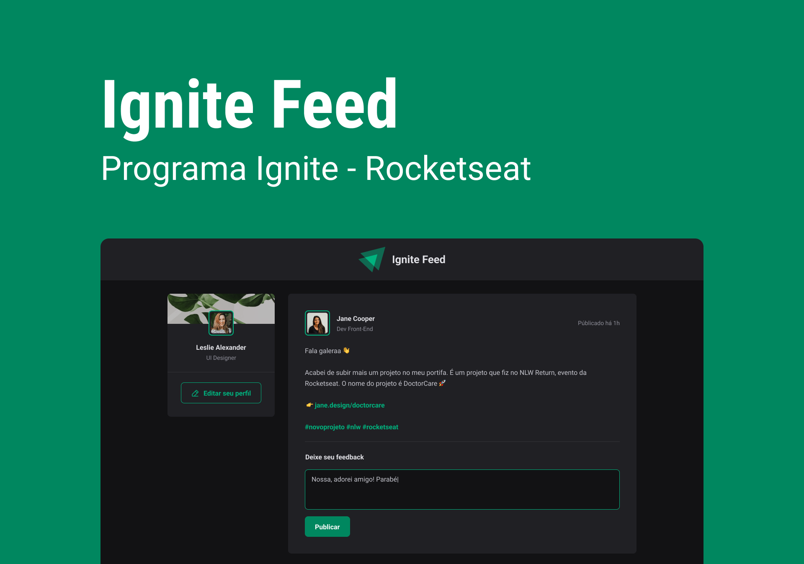
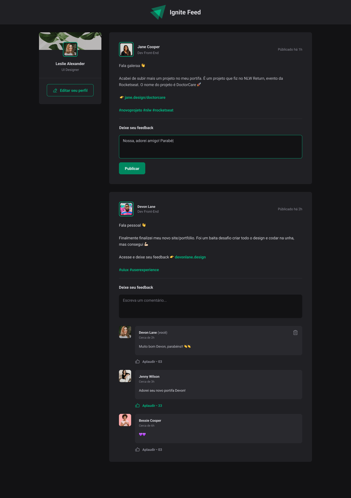

<h1 align="center">
  
</h1>

<h4 align="center">
  Ignite Feed - Concluded 🚀
</h4>

<p align="center">
 <a href="#-about-the-project">About</a> •
 <a href="#-functionalities">Functionalities</a> •
 <a href="#-layout">Layout</a> •
 <a href="#-how-to-run-the-project">How to run</a> •
 <a href="#-technologies">Technologies</a> •
 <a href="#-author">Author</a> •
 <a href="#user-content--license">License</a>
</p>

## 💻 About the project

Ignite Feed - is a ReactJS project developed with Vitejs. This project simulates a social network where it is possible to add comments and likes within posts and also remove these comments.

Project developed during the **Ignite Program** on the ReactJS track taught by [Rocketseat](https://www.rocketseat.com.br/).

---

## ⚙️ Functionalities

- [x] Users can:
  - [x] add comments;
  - [x] like comments;
  - [x] delete your own comments.

---

## 🎨 Layout

The application layout is available in Figma:

<a href="https://www.figma.com/file/XakPTEjiNdP8Pfv5lAjCNM/Ignite-Feed-(Community)">
  
</a>

### Web

<p align="center" style="display: flex; align-items: flex-start; justify-content: center;">
  
</p>

---

## 🚀 How to run the project

This is a frontend project.

### Prerequisites

Before starting, you will need to have the following tools installed on your machine:
[Git](https://git-scm.com), [Node.js](https://nodejs.org/en/).
Also it's nice to have an editor to work with the code like [VSCode](https://code.visualstudio.com/)

#### 🧭 Running the web application (Frontend)

```bash

# Clone this repository
$ git clone git@github.com:yuricavalini/ignite-feed.git

# Access the project folder in your terminal/cmd
$ cd ignite-feed

# Install the dependencies
$ npm install

# Run the application in development mode
$ npm run dev

# The application will open on port:5173 - go to http://localhost:5173

```

---

## 🛠 Technologies

Main tools used in the construction of the project:

#### **Website**  ([React](https://reactjs.org/)  +  [TypeScript](https://www.typescriptlang.org/))

- **[Phosphor-React](https://github.com/phosphor-icons/react)**
- **[Prop-types](https://github.com/facebook/prop-types)**
- **[Date-fns](https://date-fns.org/)**

> See the full file [package.json](https://github.com/yuricavalini/ignite-feed/blob/master/package.json)

**Utilities**

- Prototype:  **[Figma](https://www.figma.com/)**  →  **[Prototype (Ignite-Feed)](https://www.figma.com/file/XakPTEjiNdP8Pfv5lAjCNM/Ignite-Feed-(Community))**
- Standardization of design and code: **[Eslint](https://eslint.org/)** - **[Commit-msg-linter](https://github.com/legend80s/commit-msg-linter)** - **[Husky](https://typicode.github.io/husky/#/)** - **[Lint-staged](https://github.com/okonet/lint-staged)** - **[EditorConfig](https://editorconfig.org/)**
- Editor:  **[Visual Studio Code](https://code.visualstudio.com/)**

---

## 🦸 Author

<div align="center">
  <a href="https://github.com/yuricavalini">
  
  <br />
  <sub><b>Yuri Cavalini</b></sub></a> <a href="https://github.com/yuricavalini" title="Yuri Cavalini">🚀</a>
  <br />
  </a>
</div>
<br />
<div align="center">
  <a title="yuricavalini@gmail.com" href="mailto:yuricavalini@gmail.com?subject=Contact" target="_blank">
    
  </a>
  <a href="https://discordapp.com/users/9585" target="_blank">
    
  </a>
  <a href="https://linkedin.com/in/yuricavalini" target="_blank">
    
  </a>
</div>

---

## 📝 License

This project is licensed [MIT](./LICENSE).

Made with ❤️ by Yuri Cavalini 👋🏻 [Entre em contato!](https://www.linkedin.com/in/yuricavalini/)
